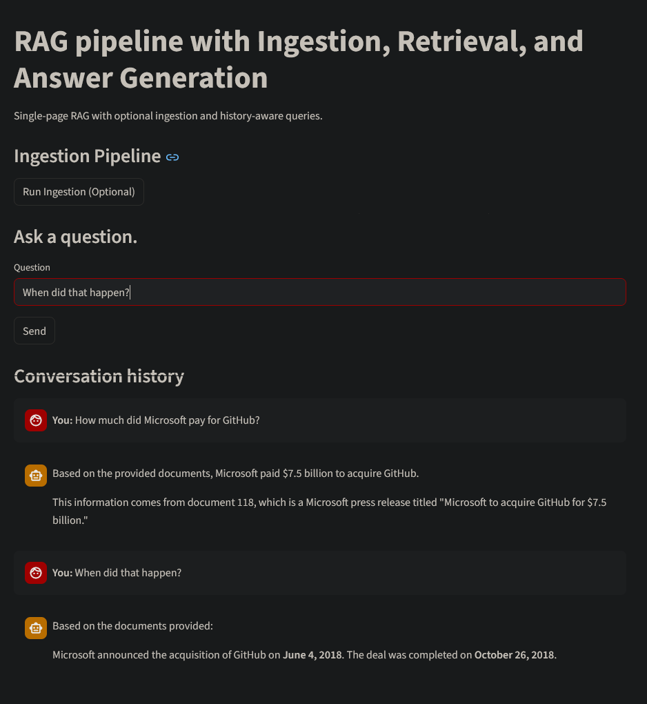

# WikiRAG Chat

### RAG Chat App with History-Aware Generation

**WikiRAG Chat** is a single-page Streamlit application demonstrating a Retrieval-Augmented Generation (RAG) workflow with chat history. It uses LangChain and Chroma to ingest Wikipedia `.txt` documents, create embeddings, and enable retrieval for user queries. Users can ask questions, see context-aware follow-ups, and re-ingest documents to update the vector store. The app combines ingestion, retrieval, answer generation, and history-aware query rewriting into a clean, interactive interface.



## Project Structure

- `ingestion_pipeline.py` – Load `.txt` documents from `docs/`, split into chunks, create embeddings, and store them in a Chroma vector database.
- `retrieval_pipeline.py` – Load the vector store and configure a retriever to fetch relevant documents for a query.
- `answer_generation.py` – Generate answers using retrieved documents with a chat model (`ChatOllama`).
- `history_aware_generation.py` – Manage conversation history; rewrite user queries to be standalone and context-aware before retrieval and answer generation.
- `app.py` – Streamlit interface to interact with the pipeline: ingest documents, ask questions, view answers, and track chat history.

## Setup

1. Install dependencies:

```bash
pip install -r requirements.txt
```

2. Ensure `docs/` contains `.txt` documents (sample Wikipedia articles provided).

3. (Optional) Load environment variables if using `.env` for Ollama API configuration.

## Usage

1. Run the Streamlit app:

```bash
streamlit run app.py
```

2. Use the app to:

   - Ingest or re-ingest documents into the vector store.
   - Ask questions and receive answers.
   - See conversation history updated live, with context-aware query rewriting.

3. The app automatically handles retrieval, answer generation, and history-aware query processing.

## Example

The chat history shows user queries and assistant answers for previous questions. It allows context-aware follow-ups, e.g.:

- **You:** "How much did Microsoft pay for GitHub?"
- **Assistant:** "Microsoft paid $7.5 billion."
- **You:** "When did that happen?"
- **Assistant:** "Microsoft completed its acquisition on October 26, 2018."


## Notes

- The ingestion pipeline supports editing or adding documents and re-ingesting to update embeddings.
- Uses **CharacterTextSplitter** for document chunking.
- The app is intentionally simple and single-page to demonstrate the RAG workflow with chat history.
